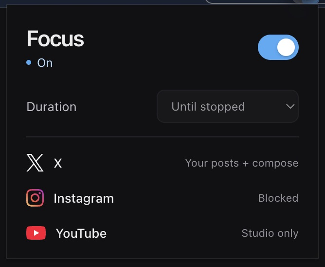
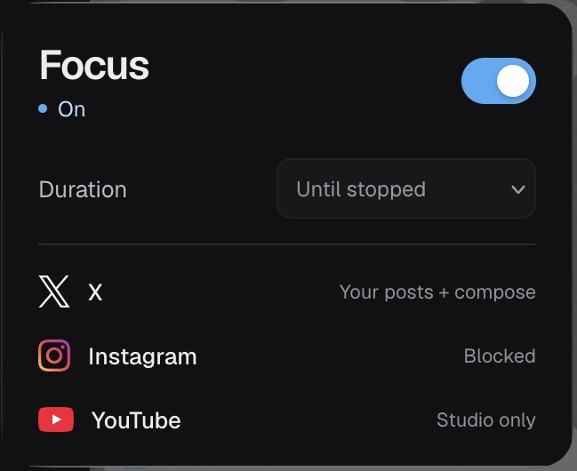
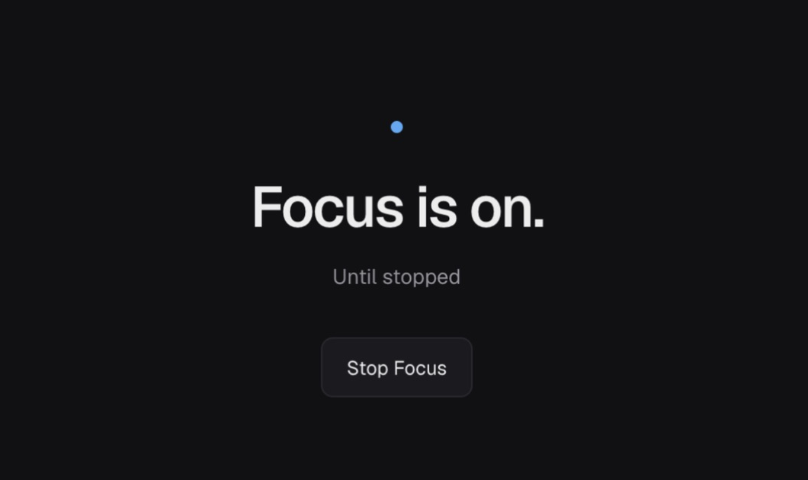

# Focus

Go be useful. A local browser extension for **Helium and Zen** that keeps social apps focused on creating.

- **X:** your own profile’s Posts, your posts, the native composer, and your posts’ three-dot menus for pinning. Other routes return to your profile.
- **Instagram:** blocked.
- **YouTube:** blocked; YouTube Studio and YouTube Music stay available.
- One toggle, with sessions of 25, 50, 90 minutes, or until stopped. Existing X drafts stay in place when recognized.

No server, tracking, account, or API keys. Sessions stay in each browser. Your X profile is detected from the signed-in page.

## Screenshots

| Helium | Zen |
| --- | --- |
|  |  |

Blocked pages show only “no.”; stop Focus from the toolbar popup:



## Install

**Helium:** open `chrome://extensions`, enable Developer mode, choose **Load unpacked**, and select this repo’s `dist/` folder.

**Zen:** open `about:addons` → tools menu → **Install Add-on From File**, then select `Focus-Zen.xpi`. This unsigned local build requires `xpinstall.signatures.required=false` in `about:config`, which also permits other unsigned add-ons. Alternatively, load `dist-zen/manifest.json` through `about:debugging` for a temporary install until restart. Requires Firefox 142+.

Pin Focus, open signed-in X once, and toggle it on. It starts off. Save any X draft before updating the extension or refreshing its page.

## Develop

Node.js 22+:

```sh
npm ci
npm run typecheck
npm test
npm run build       # Helium → dist/
npm run build:zen   # Zen → dist-zen/
```

Repackage Zen on macOS:

```sh
rm -f Focus-Zen.xpi
(cd dist-zen && zip -qr ../Focus-Zen.xpi .)
```

X changes its UI frequently; unfamiliar layouts stay covered. Helium supplies a square native popup backing around the rounded document.

## License

[MIT](LICENSE). Bundled Geist and social logos retain their [licenses and attribution](src/assets/README.md).
